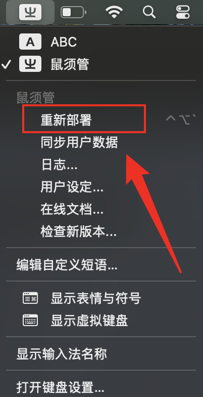
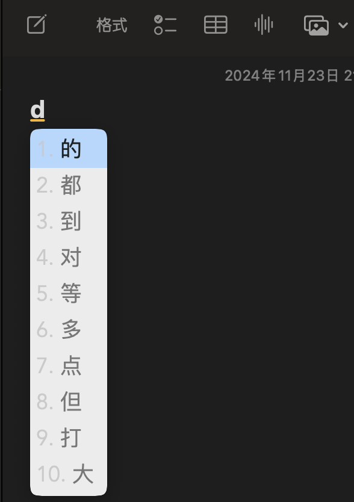
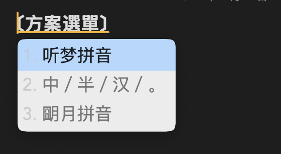

# 安裝

## MacOS
```
git clone https://github.com/Timozer/squirrel.timozer_pinyin.git
cp -rf squirrel.timozer_pinyin/* ~/Library/Rime/
```
然后点击重新部署, 如下:


随便打开一个文本编辑器, 随便输入一个字符, 弹出中文选择菜单的时候, 输入 Ctrl + Grave 选择听梦拼音, 如下:




